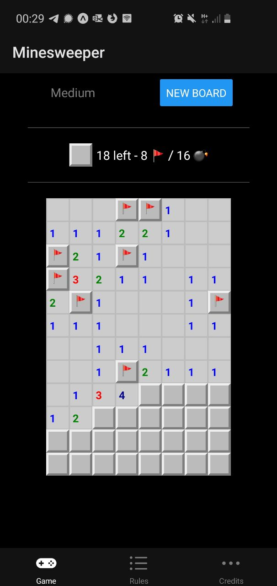

# Mineplanet project 💣

This is a prototype of a Minesweeper game realized in React Native using Expo.

To play, visit [this website](https://expo.io/@feust/projects/mineplanet) on your computer, then scan the QR Code on your phone with the Expo app!

If you don't have Expo, you can download the APK (for Android) [here](https://expo.io/artifacts/cf587f59-49e7-4c09-b425-3285a3aacc96)

## 📸 Screenshots

The game looks like this:



## ✨ Features

- full minesweeper game
- pleasant user experience:
  - simple touch to discover a cell
  - double touch to pin a flag where you have located a bomb
  - smart vibrations so it's easier to interact
  - show wrongly flagged cells after defeat
- easy / medium / hard levels
- dark / light mode depending on your device default
- explained rules for newcomers

## 🏠 Running it locally

```
git clone https://github.com/EwenQuim/mineplanet
yarn install
yarn start
```

This starts an Expo server.

- Be connected on the same local network (use your mobile data for example)
- Start your Expo app (or download it from your store)
  - the was tested on web browser & a physical android device but not an a real iPhone
- Scan the QR Code provided by expo
- Here you are 🎉

## 🔀 Technical choices & implementation

I have made some choices. As every technical choice, they must be documented.

### OOP description

I used classes to represent the board and cells.

It is a very handy way to deal with complex infrastructures, and helps a lot having a clean code.

A nice way to code it to separate the _logical_ part of the _graphic_ part of an app, that's what I tried to do with these.

### TypeScript

TypeScript is better than JavaScript.

I share the same opinions as [this article](https://dzone.com/articles/what-is-typescript-and-why-use-it).

Moreover, TS articulates well with an object-oriented paradigm.

### Main structure

Every cell have their own press & longPress function as prop, which is redundant.
I could have avoided that by using **Redux**, but I haven't.

Redux allows to share a state between component.
This lib is very handy because it allows easy and automatic re-rendering for components sharing the state.

Why haven't I used Redux ?

- First, it might have been over-killed. It is a powerful feature that we simply do not _need_ here. We can do otherwise, and redux adds a bit of complexity for nothing, with all the store configuration. Sometimes it is wise not to use librairies just because they look good, but they do not add any value
- This is a test about React Native, not about any lib
- It's better to push React Native to its limits before using someone else's work

I might use Redux for a (local) leaderboard system I'll do later

## My experience doing this work

I am not a React Native Expert. In fact, I just started learning React Native for this test...

I hope I didn't do too bad, and even if my choices are wrong, at last you know why I made them. (and that's sometimes the most important).
